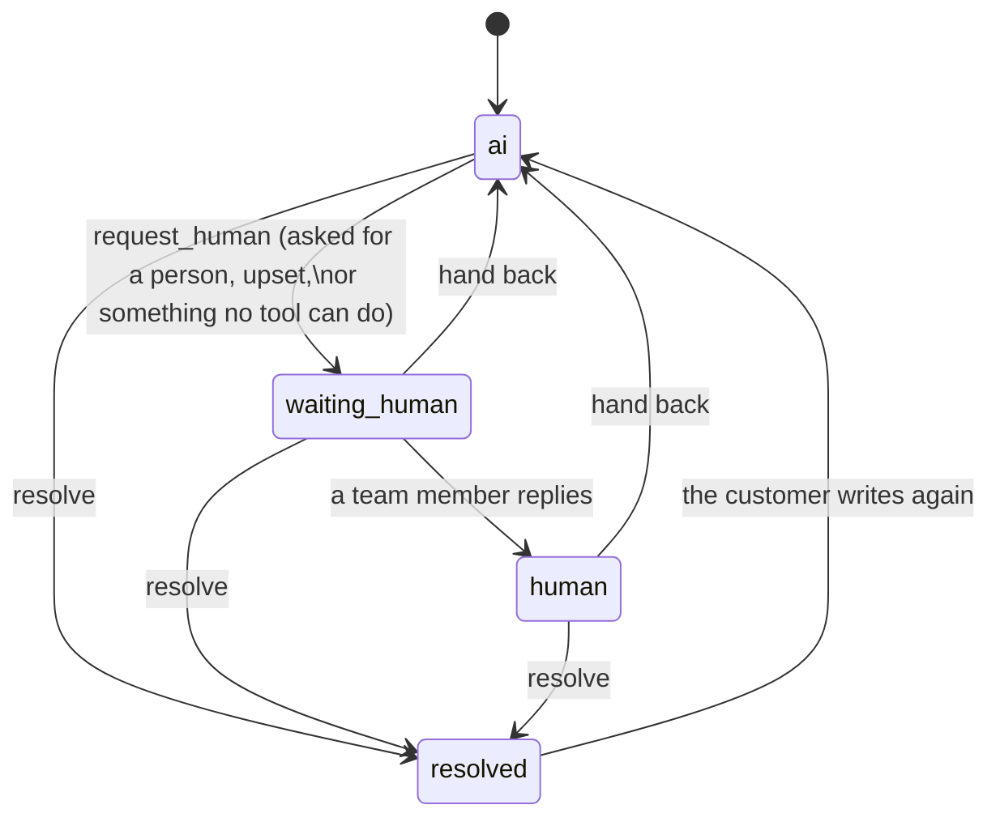

# Business Agent Platform

A multi-tenant AI assistant platform for small businesses. Each business (tenant) uploads its
documents, and the assistant answers customer questions from them with citations, takes actions
through tools, and hands off to a human when needed. This repository currently contains the
foundation: a FastAPI backend on PostgreSQL 16 (pgvector) and Redis 7 with tenants, API-key
authentication, tenant data isolation and document ingestion, run locally with Docker Compose.

## Run locally

Requires Docker and [uv](https://docs.astral.sh/uv/).

```bash
cp .env.example .env          # placeholder values; edit if you like
docker compose up --build     # postgres, redis, migrate (role + migrations), api, worker
curl localhost:8000/health    # {"status":"ok","database":"up"}

# Demo tenants with ingested demo/ knowledge (prints keys once; store them)
docker compose run --rm migrate python -m app.cli seed-demo
docker compose run --rm migrate python -m app.cli create-tenant --name "Rosa's Pizzeria" --slug rosas
docker compose run --rm migrate python -m app.cli create-key --tenant rosas --kind widget

curl -H "Authorization: Bearer bap_admin_..." localhost:8000/v1/documents
curl -H "Authorization: Bearer bap_admin_..." -F file=@menu.csv localhost:8000/v1/documents
curl -H "Authorization: Bearer bap_admin_..." -H 'content-type: application/json' \
     -d '{"query": "borhani er dam koto?", "mode": "hybrid", "top_k": 5}' localhost:8000/v1/search
curl -N -H "Authorization: Bearer bap_admin_..." -H 'content-type: application/json' \
     -d '{"visitor_id": "v1", "message": "How much is the Kacchi Biryani?"}' localhost:8000/v1/chat
```

Set `GEMINI_API_KEY` in `.env` for real embeddings; without it the stack uses deterministic
fake embeddings (fine for development, useless for search quality).

API docs: http://localhost:8000/docs. If you have a database volume from before the app role
existed, recreate it with `docker compose down -v`.

## Run the tests

Tests need the Compose Postgres and Redis running. They use a separate database
(`TEST_DATABASE_NAME`, default `app_test`) and Redis database 15, always use fake embeddings, and
cannot reach the network.

```bash
docker compose up -d postgres redis
cd backend
uv sync
uv run ruff check . && uv run ruff format --check .
uv run pytest
```

Apply migrations by hand with `uv run alembic upgrade head` (from `backend/`).

## Multi-tenancy

Every request is authenticated with `Authorization: Bearer <key>`. A key belongs to one tenant
and has one of two kinds:

- **admin** (`bap_admin_…`): secret, for the business owner's dashboard; full access to that
  tenant's `/v1` routes.
- **widget** (`bap_widget_…`): public, embedded in a website; will be allowed only on
  customer-facing chat endpoints. Admin routes reject it with 403.

Only the sha256 hash of a key is stored; the full key is shown once, when it is created.
Tenants themselves are created with the platform CLI, not through the API.

Tenant data is isolated in two layers:

1. **Application:** routes access tenant-owned tables only through `TenantDB`
   (`backend/app/tenancy.py`), which adds `WHERE tenant_id = <authenticated tenant>` to every
   query and sets `tenant_id` on every new row.
2. **Database:** every tenant-owned table has Postgres Row-Level Security, forced, with a policy
   requiring `tenant_id = current_setting('app.current_tenant')`. Each request sets that value
   for its own transaction only. A query that forgets its filter, or runs with no tenant set,
   returns no other tenant's rows (or no rows at all).

Postgres skips RLS for superusers and for a table's owner, so if the API connected as the
owner role, the second layer would do nothing. The API therefore connects as a separate,
non-superuser role (`bap_app`, `DATABASE_URL`) that owns nothing and has only the grants it
needs. Migrations and the CLI use the owner role (`OWNER_DATABASE_URL`); in Compose they run in
the one-shot `migrate` service, so the API container never has owner credentials.

## Ingestion

A tenant adds knowledge with `POST /v1/documents` (file upload) or `POST /v1/documents/url`.
The API stores the source, creates the document as `pending` and returns 202 at once; a
background worker (`arq` on Redis, the `worker` service) parses, chunks, embeds and stores it,
then sets `ready` or `failed` with an error message. Uploading identical content again returns
the existing document. `POST /v1/documents/{id}/reingest` rebuilds a document's chunks, and the
new chunks replace the old ones in a single transaction, so readers never see a mix. `DELETE`
removes the document, its chunks and its stored file.

**Sources:** PDF, Markdown, plain text and CSV uploads (UTF-8, up to 10 MB), and public web pages
(HTML main text, plain text, Markdown or PDF).

**Chunking:** chunks follow the document's structure instead of fixed-size windows, because a
chunk that mixes two topics, or stops mid-sentence, retrieves badly and reads badly when quoted.
Prose is split by heading (a chunk never crosses into the next section), then packed from whole
sentences (English `. ! ?` and the Bengali `।`) to about 400 tokens, preferring paragraph breaks,
with a small overlap of whole sentences. CSV files become one chunk per row, rendered as
`column: value` lines, so a menu item or product stays intact with its price and attributes.
Each chunk records its section heading, page or row number and source. The embedded text is
prefixed with the document title and section heading so a chunk makes sense on its own; the
original text is stored unchanged. Keyword search uses Postgres's `simple` configuration
(content is English and Bengali, and Postgres has no Bengali stemmer).

**Embeddings:** `gemini-embedding-2` at 768 dimensions (`EMBEDDING_PROVIDER`, `GEMINI_API_KEY`),
batched, with retries and exponential backoff on rate limits and transient errors. Providers
live behind one interface in `backend/app/embeddings/`.

**SSRF protection for URLs:** only `http`/`https` without credentials; the host is resolved and
every address must be public (private, loopback, link-local, CGNAT, reserved and multicast
ranges are refused, including IPv4-mapped IPv6); the connection is pinned to the checked address
so DNS cannot change between check and connect; redirects are followed manually and each hop is
checked again; responses are capped at 5 MB and 20 seconds; proxy environment variables are
ignored. The API checks the URL when it is submitted and the worker checks it again on fetch.

**Known limitation:** there is no OCR. A scanned PDF (images without a text layer) ends as
`failed` with "no extractable text; OCR is not supported yet".

## Retrieval

`Retriever.retrieve(tenant_id, query, mode, top_k)` (`backend/app/retrieval/`) returns the most
relevant chunks with their scores; `POST /v1/search` exposes it for testing a knowledge base, with
per-stage timings. There are four modes, all kept so they can be compared on an eval set:

- **vector**: the query is embedded (cached in Redis per tenant and normalized query) and
  compared to chunk embeddings by cosine similarity. Only chunks embedded with the same model are
  compared.
- **keyword**: full-text match over each chunk's `tsvector`. Every query word is a separate
  term weighted by how rare it is in the tenant's chunks (inverse document frequency), so a
  question does not need every word to match, one rare term ("borhani") is enough, and more
  matching terms rank higher. Common question words in English, Bengali and romanized Bengali
  are ignored. Compound tokens such as product codes (`JL-SAR-001`) are also matched as an exact
  phrase, so the exact code outranks its look-alikes.
- **hybrid**: the vector and keyword rankings merged with **Reciprocal Rank Fusion**: each
  chunk scores `sum(1 / (k + rank))` over the rankings it appears in (`RRF_K`, default 60). RRF
  needs only ranks, so it can merge cosine similarities and keyword weights, which live on
  unrelated scales, without calibrating one against the other. Vector search finds paraphrases
  and cross-language matches (a Bengali question about English opening hours); keyword search
  finds exact names and codes that embeddings blur together.
- **hybrid_rerank**: the top 15 fused candidates are scored 0–10 by a small, cheap LLM
  (`gemini-3.5-flash-lite`, structured JSON output, validated strictly). Any failure or timeout
  keeps the fused order and is reported, so reranking can never make results worse than hybrid.

**Why the `simple` text configuration:** content is in English and Bengali (and customers write
romanized Bengali). Postgres has no Bengali stemmer, and an English stemmer would mangle Bengali
and romanized words, so text is lowercased and split into words without stemming or a built-in
stop-word list. Exact dish names, codes and Bengali words therefore match reliably; inflections
and paraphrases are left to vector search.

**The filtered index problem:** the HNSW vector index finds approximate nearest neighbours
first and applies the tenant filter afterwards, to only the first ~`hnsw.ef_search` candidates.
A tenant that owns a small share of the table can then get fewer than `top_k` results, or none
(the test shows 0 of 5 for a tenant with 8 chunks next to one with 2,000). The fix has two
layers: pgvector's **iterative index scan** (`hnsw.iterative_scan = relaxed_order`) keeps
scanning until enough rows pass the filter, with results re-sorted by exact distance; and if the
index still returns too few rows while the tenant has more, an **exact scan over that tenant's
rows** fills the gap.

**Confidence:** every result set includes the best vector similarity and `has_relevant_context`
(similarity >= threshold). The chat step uses it to say "I don't know" instead of guessing. The
starting threshold for `gemini-embedding-2` is 0.65: in a first check on the demo data,
on-topic questions scored 0.72–0.83 and off-topic ones 0.53–0.59. Similarities are model-
specific, so each embedding provider suggests its own value and `RELEVANCE_THRESHOLD` overrides
it; it will be tuned against evals.

## Chat

`POST /v1/chat` answers a customer's question from the tenant's knowledge, with citations. It
accepts a widget key (from a website) or an admin key:

```json
{"conversation_id": null, "visitor_id": "v-123", "message": "kacchi koto?",
 "client_message_id": "3f2c9a…", "stream": true}
```

With `stream: true` it sends Server-Sent Events: `token` events with the reply text, then
`citations`, then `done` (message id, conversation id, outcome, token usage and timings, including
time to first token). If generation fails it sends one `error` event instead. `stream: false`
returns the whole reply as one JSON object. `client_message_id` makes retries idempotent:
resending the same id never stores the message twice, and if the first attempt already finished,
the stored reply is returned again (`replayed`). `GET /v1/conversations` and
`GET /v1/conversations/{id}` (admin key) list conversations and show messages with citations,
outcomes, searches, timings and the model that answered.

**The tool loop** (`backend/app/chat/`). Each customer message is one tool-calling turn, not
"always search, then answer". The chat model gets the recent conversation and a
`search_knowledge(query)` tool, and decides for itself:
- **Replies directly, with no search,** to greetings, thanks, small talk, clarifying questions,
  and follow-ups already answered in the conversation. Sources cited in the last two replies
  are offered up front as numbered "earlier sources", so "ota ki jhal?" after a price question
  can be answered and cited without searching again.
- **Calls `search_knowledge`** when it needs a fact about the business, and writes the query
  itself (e.g. "Kacchi Biryani price spice"). No separate rewrite step, so no extra model call.
  Search is hybrid, top 8 (`CHAT_RETRIEVAL_MODE=hybrid_rerank` turns the reranker on). A result
  counts as relevant if the similarity clears the threshold or keyword search found a strong
  exact match.
- **At most 2 searches per message** (`CHAT_MAX_SEARCHES`). After that, the model gets no tool
  and must answer with what it has.
- **The registry is the extension point:** tools live in a `ToolRegistry`; the action tools
  (catalogue, reservations, order lookup, leads) are described under [Tools](#tools).

**Grounding and outcomes.** Every fact about the business (prices, hours, policies, stock,
location) must come from a search result or earlier source in this conversation, and is cited
`[n]`. A streaming filter drops any marker that matches no source actually found. If a search
finds nothing relevant, the reply says so and includes the fallback contact (code appends it if
the model left it out). The outcome is decided in code from what can be verified:
- **`answered`:** the reply cites at least one real source.
- **`no_answer`:** a search was made but nothing was cited (nothing relevant, or an ungrounded
  reply), the model reported it could not help (off-topic, or a booking it can't make), or it
  claimed an answer with nothing to verify it. These feed the knowledge-gaps report.
- **`handoff`:** the conversation was handed to a person this turn (see
  [Human handoff](#human-handoff)).
- **`action`:** a write tool completed in this turn (a reservation booked, a lead saved).
- **`smalltalk`:** no search and no claim.
- **`error`:** generation failed.

A successful order lookup also counts as `answered`, because the facts come from a tool result.

The model's hidden status tag (`[[answered]]`, `[[no_answer]]`, `[[smalltalk]]`, stripped
before streaming) is used only where code cannot decide: smalltalk versus a polite "can't help"
when nothing was searched or cited.

**Time awareness.** Each tenant has a `timezone` (the demo tenants use `Asia/Dhaka`). Every turn,
the system prompt states the business's current local date, weekday and time, e.g. "Saturday, 3
October 2026, 7:30 PM (Asia/Dhaka)". For "are you open now?" the model searches the opening
hours, compares them with that time, and answers plainly ("Yes, we're open until 11 pm
tonight").

**Voice.** The prompt asks for a friendly staff member texting a customer:
- Short and warm: one to three sentences unless a list is needed.
- No "As an AI", no "based on the information provided", no "How else can I assist you?"
  closings, no restating the question.
- Replies in the customer's language and script. Romanized Bengali gets natural Banglish back,
  the way people in Dhaka text (e.g. "Ji, amra ekhon khola, raat 11 ta porjonto."), not stiff
  transliteration.
- It doesn't volunteer that it is an AI. If a customer sincerely asks whether they are talking
  to a person or a bot, it says briefly that it is the business's virtual assistant and offers
  the human contact. It never claims to be human.
- Tone and extra instructions are per-tenant settings (`tone`, `instructions`).

Customer messages, search results and earlier sources sit inside tags whose names carry a random
per-turn nonce, and the prompt treats them as data, never as instructions.

**Models, failover and latency.** `CHAT_MODELS` lists `provider:model` candidates in order. The
default is `gemini-3.8-flash` (Google's default general-purpose model) with `gemini-3.6-flash` as
fallback. Setting `OPENAI_COMPAT_BASE_URL`, `OPENAI_COMPAT_API_KEY` and `OPENAI_COMPAT_MODEL`
makes any OpenAI-compatible endpoint the **primary** model, with the `CHAT_MODELS` entries as
its fallbacks (streaming and tool calls supported). The demo setup uses Groq with
`openai/gpt-oss-120b` and `OPENAI_COMPAT_REASONING_EFFORT=low`. That is Groq's featured model,
it supports tool use and streaming, and its free tier allows 1,000 requests a day but only 8,000
tokens a minute: about one searching turn a minute. Embeddings stay on Gemini only, because
vectors from different models are not comparable.
- **Fast failover:** if a model returns overload or rate-limit errors, or produces no token or
  tool call within `CHAT_FAILOVER_SECONDS` (3 s), the next candidate is tried at once. The
  failed model is skipped for a minute (`CHAT_COOLDOWN_SECONDS`), or only as long as its
  `Retry-After` header asks if that is shorter, so the following turns don't
  pay the same delay. Once a model has started streaming it is never switched silently.
- **Recorded model:** the stored message records the model that actually answered.
- **Thinking:** each request uses the model's lowest thinking level (3.8-flash: low; 3.6-flash:
  minimal).
- **Targets:** under 2.5 s to first token for a direct reply, under 4 s for one that searches.
  A searching reply needs two model calls plus one search, so the query embedding (cached per
  tenant and question in Redis) and the model's own first-token time dominate.

Measured so far:
- **Pipeline overhead, offline** (fake model and embeddings, measured from the start of the turn
  to the first token): about 0.1 ms for a direct reply, and 3 ms (max 5 ms) for a reply that
  searches. Real latency is therefore almost entirely the model's time plus the query-embedding
  call.
- **Real Gemini, 2026-10-03 (chat quality):** blocked. `gemini-3.8-flash` was overloaded (503) and the free-tier
  daily quota of `gemini-3.6-flash` (20 requests) was exhausted. The failover itself worked
  (503 → fallback in milliseconds → clean apology in 1.8 s), but no answer timings could be
  measured. Re-run `evals/chat_script.py` once quota is available.
- **Groq `openai/gpt-oss-120b`, 2026-10-03** (`evals/chat_script.py`, both suites, all on the
  primary model): time to first token 0.4 to 0.9 s for direct replies and 1.4 to 2.5 s for
  replies that search or query the catalogue; totals within 0.1 s of first token. Both targets
  are met. The free tier allows 8,000 tokens a minute (about one searching turn a minute) and
  200,000 tokens a day (about 25 to 30 searching turns); the daily token limit ended
  the run before the last shop turns of the final pass.
- **Real Gemini, 2026-10-03 (action tools):** blocked. Both models returned the free-tier daily
  quota error (429, 20 requests a day per model) on the first message. Run
  `evals/chat_script.py --suite actions` once quota is available.

**Protections for the public endpoint** (widget keys are visible in websites):
- **Allowed origins:** widget requests must come from one of the tenant's `allowed_origins`.
  CORS headers are returned only for that origin.
- **Rate limits:** Redis counters per key and per visitor per minute, and a per-tenant daily
  message cap. Over-limit requests get 429 with a clear message and `Retry-After`.
- **Message length:** messages are limited to 2,000 characters (422 if longer).
- **Conversation ownership:** a conversation can only be continued by the same tenant and
  visitor.
- **Failures:** a model error or timeout (first token, idle gap or total) ends the stream with an
  `error` event and a short apology with the fallback contact, and is stored with the error. A
  stream never hangs.

## Tools

The model chooses tools; code decides what they may do. Each tenant's `enabled_tools` setting
lists the tools offered to its model. A tool not in the list is never offered, and a call to it
is refused (`not_allowed`). The demo restaurant has `search_knowledge`, `query_catalog`,
`create_reservation`, `capture_lead` and `request_human`. The demo shop has `search_knowledge`,
`query_catalog`, `lookup_order`, `capture_lead` and `request_human`.

Rules for every tool:
- **Validated arguments:** arguments are checked by a Pydantic model (unknown fields
  rejected). Invalid arguments are never executed: the validation errors go back to the model
  so it can ask the customer or try again. That includes calls a provider rejects against the
  schema itself (Groq's `tool_use_failed`), which are handed back to the registry as ordinary
  calls.
- **Results are data:** tool results go to the model inside nonce-delimited tags, like search
  results, and the prompt treats them as data, never as instructions.
- **Every call is recorded** in `tool_calls`, linked to the assistant message, with its
  arguments, status (`ok`, `invalid_arguments`, `not_allowed`, `refused`,
  `needs_confirmation`, `rate_limited`, `error`), a result summary and its duration.
- **Per-visitor limits:** Redis fixed windows per tenant, visitor and tool. Write tools allow 6
  calls an hour; `lookup_order` allows 5.

| Tool | Does | Arguments |
|---|---|---|
| `search_knowledge` | Searches the business's documents (see [Chat](#chat)) | `query` |
| `request_human` | Hands the conversation to a person (see [Human handoff](#human-handoff)) | `reason` |
| `query_catalog` | Lists and filters catalogue rows: menus, product lists | `text`, `category`, `min_price`, `max_price`, `in_stock`, `attributes` (name contains value), `sort`, `limit` (1–25) |
| `create_reservation` | Books a table (write) | `date`, `time` (HH:MM), `party_size`, `name`, `phone`, `notes` |
| `lookup_order` | Shows an order's status | `order_number`, `phone_last4` |
| `capture_lead` | Saves a sales enquiry for the business to follow up (write) | `name`, `contact` (phone or email), `interest` |

**Catalogue.** Upload a CSV with `catalog=true` on `POST /v1/documents`. It is chunked and
embedded like any document, so it stays searchable. Each row is also stored in
`catalog_items` with its name, alternative name (e.g. Bengali), category, price, currency, stock
flag and the remaining columns as attributes. Re-ingesting replaces the rows. The optional
`catalog_mapping` form field (JSON) maps fields to CSV columns:

```json
{"name": "dish_en", "alt_name": "dish_bn", "category": "category",
 "price": "price_bdt", "currency": "BDT", "in_stock": "stock_status"}
```

- **Auto-detection:** fields left out are detected from common column names
  (`name`/`dish_en`/`product`, `name_bn`/`dish_bn`, `category`, `price`/`price_bdt`,
  `stock`/`in_stock`/`available`).
- **Currency:** a column, a literal code, a price-column suffix (`price_bdt`), or the tenant's
  `currency` setting.
- **Stock:** "no", "out of stock", "sold out" and similar mean out of stock.
- **Attributes:** every other column becomes an attribute, with its key lowercased and spaces
  turned into underscores.

Catalogue results cite the row's chunk, so `[n]` markers and citations work as for search
results. Both demo CSVs (`menu.csv`, `products.csv`) are catalogues.

**Confirmation before writing.** `create_reservation` and `capture_lead` never write on the
first call. The rule is enforced in code, not left to the prompt:
1. The first call stores a pending proposal and returns "NOT DONE YET" with the details, which
   the assistant reads back to the customer.
2. The write happens only when the model calls again with the same details (compared after
   normalising name case and phone digits), in a later customer turn than the proposal, within
   30 minutes, and when the customer's message reads as a confirmation ("yes", "confirm", "ji",
   "haa", "thik ache", "হ্যাঁ", "করুন"; any "no"/"na"/"না"/"wait" blocks it).
3. Changed details produce a new proposal, which needs its own confirmation.
4. A repeated confirmation never writes twice: the proposal is marked done, the booking or
   lead has a unique link to it, and later calls get "Already done" with the existing
   reference.

**Reservations.**
- **Settings:** each tenant has `opening_hours` (per weekday, e.g.
  `{"mon": [["12:00", "23:00"]]}`; a closing time after midnight is allowed) and
  `max_online_party_size`.
- **Timezone:** dates and times are the business's local time in its `timezone`.
- **Refused:** past times, times less than 30 minutes away, more than 60 days ahead, outside
  opening hours (last seating 30 minutes before closing), and no hours configured. Parties
  over the limit get the phone contact instead.
- **Result:** a confirmed booking gets a reference such as `R-7KQ2MX`.

**Order lookup privacy.** `lookup_order` needs the order number and the last 4 digits of the
phone number on the order.
- **Same answer on a miss:** an unknown order and wrong digits return exactly the same "not
  found" text, so the tool cannot be used to discover which order numbers exist.
- **Attempt limit:** 5 lookups per visitor per hour.
- **Limited result:** only status, items, total and shipping details are returned, never the
  phone number.

**Leads.** The assistant collects a name, a contact and what the customer wants, confirms, and
saves the lead linked to the conversation. It only promises a follow-up time if the tenant has
set `follow_up_promise` (the demo shop: "within one working day"). Otherwise it says the team
will be in touch, with no time.

**Admin endpoints** (admin key):

| Endpoint | Purpose |
|---|---|
| `GET /v1/reservations` | List reservations (filter by `status`) |
| `PATCH /v1/reservations/{id}` | Set status: `confirmed`, `cancelled`, `completed`, `no_show` |
| `GET /v1/leads`, `GET /v1/orders`, `GET /v1/catalog` | List leads, orders, catalogue rows |
| `GET` / `PUT /v1/webhooks/endpoint` | Show or set the webhook URL (the secret is shown once, when first created) |
| `POST /v1/webhooks/endpoint/rotate-secret` | Issue a new signing secret (shown once) |
| `GET /v1/webhooks/deliveries` | Delivery log: status, attempts, last status code and error |

### Webhooks

When a reservation is booked or a lead is saved, an event is recorded in the same transaction
as the write. The worker then POSTs it to the tenant's webhook URL. Events are
`reservation.created`, `lead.created`, `handoff.requested` and `handoff.resolved` (the last two
carry `conversation_id`, `channel`, `customer_name`, and `reason` or the new `status`). A
reservation looks like this:

```json
{"id": "<delivery id>", "type": "reservation.created", "created_at": "2026-10-03T13:31:02Z",
 "tenant_id": "<tenant id>", "data": {"id": "<reservation id>", "reference": "R-7KQ2MX",
 "starts_at": "2026-10-04T20:00:00+06:00", "date": "2026-10-04", "time": "20:00",
 "party_size": 4, "name": "...", "phone": "...", "notes": null, "conversation_id": "..."}}
```

Headers:
- `X-BAP-Event`: the event type.
- `X-BAP-Delivery`: the delivery id. It stays the same across retries, so use it to ignore
  duplicates.
- `X-BAP-Timestamp`: Unix seconds at send time.
- `X-BAP-Signature`: `v1=` followed by the lowercase hex HMAC-SHA256 of
  `"<timestamp>.<raw body>"`, keyed with the endpoint secret (`whsec_...`).

To verify a delivery, compute the HMAC over the raw bytes received (not re-serialised JSON).
Compare it in constant time, and reject timestamps more than 5 minutes from your clock:

```python
expected = "v1=" + hmac.new(secret.encode(), f"{ts}.".encode() + raw_body, "sha256").hexdigest()
ok = hmac.compare_digest(expected, signature) and abs(time.time() - int(ts)) <= 300
```

Delivery rules:
- **Success:** any 2xx.
- **Retries:** other responses and network errors are retried after 10 s, 1 min, 5 min, 30
  min and 2 h (6 attempts in all), then the delivery is marked `failed`. Every attempt is
  logged on the delivery.
- **SSRF protection:** URLs must be public http(s). Private, loopback, link-local and metadata
  addresses are refused when the URL is set and again at each delivery. The connection is
  pinned to the checked IP, and redirects are not followed.

[`integrations/n8n/`](integrations/n8n/) has an n8n workflow that verifies the signature,
appends each event to a Google Sheet and sends an email alert. It is checked only as valid n8n
export JSON and has **not** been tested end to end.

## Human handoff

A customer can be handed to a person on the business's team. The model asks for this with the
`request_human` tool; everything after that is decided in code.



- **When:** the guidance asks the model to call `request_human` when the customer asks for a
  person, is clearly upset, or wants something no tool can do that the team could sort out (a
  complaint, a refund, a special request). For a fact it simply can't find, it still says so and
  gives the contact. It never claims to be human or poses as the team.
- **The acknowledgement** is written by code, not the model, in the customer's language
  (English, Banglish or Bengali script). It says whether the team is online now or when it is
  back, from the tenant's `opening_hours` and `timezone`, and uses its `follow_up_promise`
  (e.g. "within one working day") if it has one. With no hours set it says neither. The turn
  ends there, with outcome `handoff`, and costs no second model call.
- **Silence is enforced in code.** While a conversation is `waiting_human` or `human`, the
  channel pipeline stores each customer message, alerts staff, and answers with a silent response
  (`"silent": true`). No model is called, whatever the prompt says.
- **Staff replies** are messages with role `staff`. The widget shows them as "Team member", with
  no assistant name. The model sees them in its history after a hand-back, marked as the team's.
- **Events:** `handoff.requested` and `handoff.resolved` (hand back or resolve), signed like every
  webhook.

Admin endpoints (admin key):

| Endpoint | Purpose |
|---|---|
| `GET /v1/conversations?status=waiting_human` | Customers waiting for a person (also `ai`, `human`, `resolved`) |
| `GET /v1/conversations/{id}` | The conversation, with customer, assistant and staff messages |
| `POST /v1/conversations/{id}/messages` | Reply as a team member (`{"text": ...}`); the chat becomes `human` |
| `POST /v1/conversations/{id}/hand-back` | The assistant answers again |
| `POST /v1/conversations/{id}/resolve` | Close it; a new customer message reopens it with the assistant |

## Telegram

Telegram is a second customer channel. The widget and Telegram feed the same pipeline
(`app/channels/pipeline.py`), so both get the same tools, handoff, limits and outcome labels.

- **Webhook:** `POST /v1/channels/telegram/{tenant_id}/webhook`, called by Telegram.
  - **Verification:** the `X-Telegram-Bot-Api-Secret-Token` header is checked against a stored
    hash. An unknown tenant, a tenant without a bot and a wrong secret all get the same 404.
  - **Dedupe:** each `update_id` is processed once.
  - **Visitors:** the chat id becomes the visitor (`tg:<chat id>`), with one ongoing conversation
    per chat. Only private chats and text messages are answered.
- **Replies** are plain text: no `parse_mode`, Markdown or citation markers. They are split at
  natural breaks to fit Telegram's 4,096 characters.
- **Limits:** the widget's limits apply per bot, per chat and per day. When a customer hits one,
  the limit notice is sent at most once a minute.
- **Secrets:** the bot token is stored encrypted (AES-256-GCM under `SECRETS_ENCRYPTION_KEY`,
  bound to the tenant). The webhook secret is stored only as a sha256 hash, and registering the
  webhook again rotates it.
- **Staff alerts:** when a customer is handed off, or writes again while waiting, the worker
  sends the tenant's staff chat their name, the last messages and a link (`ADMIN_CONVERSATION_URL`).
  Replying to that alert in the staff chat sends the reply to the customer as a team member's
  message. Only the configured staff chat can do this; anything else there is ignored.

Setup in five steps:
1. **Create the bot:** message [@BotFather](https://t.me/BotFather), send `/newbot` and keep the
   token it gives you.
2. **Find the staff chat id:** add the bot to your staff group (or message it yourself) and send
   any message. Then open `https://api.telegram.org/bot<TOKEN>/getUpdates` and read
   `message.chat.id`; group ids are negative. Do this before step 4, because `getUpdates` stops
   working once a webhook is set.
3. **Store the token:** set `SECRETS_ENCRYPTION_KEY` in `.env` (the command is in
   `.env.example`), restart the stack, then call `PUT /v1/channels/telegram` with an admin key
   and `{"bot_token": "...", "staff_chat_id": -100...}`. The token is checked with Telegram
   first.
4. **Register the webhook:** call `POST /v1/channels/telegram/webhook` with
   `{"public_base_url": "https://your-api.example.com"}`. Telegram only calls https URLs; for
   local testing, use a tunnel such as cloudflared or ngrok.
5. **Test it:** message the bot, then ask for a person. The staff chat gets an alert; reply to
   it, and the customer gets your message. Bots in groups with privacy mode on still receive
   replies to their own messages, which is all the staff chat needs.

## Widget

The embeddable chat widget lives in `web/widget/`: TypeScript with no UI framework, bundled into
one self-contained `widget.js` (about 8 KB gzipped; the build fails above 12 KB). The API serves
it at `/widget.js`, with an ETag and a 5-minute cache. A business embeds it with one tag:

```html
<script src="https://api.example.com/widget.js" data-key="bap_widget_..." async></script>
```

`data-api` sets the API base URL if it differs from where `widget.js` is served. The widget
loads `GET /v1/widget/config` when first opened, then chats through `POST /v1/chat`, reading the
response body as Server-Sent Events. (`EventSource` cannot send a POST or an `Authorization`
header.) While a person handles the chat, the widget polls `GET /v1/chat/updates` every 5 seconds
(only while the panel is open) and shows team replies as "Team member". A silent turn leaves no
assistant bubble.

**Settings** (in `tenants.settings`, returned by `/v1/widget/config`): `assistant_name`,
`business_name`, `greeting`, `accent_color` (`#RRGGBB`; default lime `#C5EE4F`) and up to four
`suggested_questions`. `allowed_origins` controls which websites may use the tenant's widget key.
An invalid stored value falls back to its default rather than breaking the widget.

**Design tokens.** Colours, radii, spacing, shadows, type and motion are defined once in
`web/widget/src/tokens.ts`. The widget uses them as CSS custom properties (`--bap-color-ink`,
`--bap-radius-panel`, …), and the build also writes them to `dist/tokens.css` so the dashboard
can reuse them. Assistant bubbles use the tenant's accent colour, and the widget picks dark or
white text from the accent's luminance so contrast passes (lime gets dark text, terracotta gets
white).

**Security**
- Renders inside a Shadow DOM (with `all: initial` on the host), so the page's CSS cannot reach
  the widget and the widget's CSS cannot reach the page.
- No `innerHTML` anywhere. Model and server text become text nodes, so an HTML or script
  payload shows as text. Only `http:`/`https:` URLs become links (with `noopener noreferrer`);
  `javascript:`, `data:` and other schemes stay plain text. The accent colour is validated both
  server- and client-side, since it ends up in CSS.
- Widget keys work only from the tenant's `allowed_origins`, and are rate-limited (see Chat).
  The key is public by design; it cannot reach admin routes.
- `visitor_id`, the conversation id and the last 50 messages are kept in `localStorage` per
  widget key. If storage is unavailable, the widget falls back to memory.

**Accessibility**
- Every control is a labelled native `button`, `textarea` or `form`, so the whole widget works
  from the keyboard: Enter sends, Shift+Enter adds a new line.
- Opening moves focus to the input. Closing (button or Escape) returns it to the launcher.
  Focus never falls out of the panel when a control it was on disappears.
- The conversation log is `aria-live="off"`, so streamed tokens are not read one by one. Each
  finished reply (or error) is announced once through a polite live region.
- Visible focus rings, and animations and transitions are switched off under
  `prefers-reduced-motion`.
- Text contrast meets WCAG AA; tests check the token colour pairs and the bubble text choice.
- A system font stack that includes Bengali faces (Noto Sans Bengali, Kohinoor Bangla, Nirmala
  UI, Vrinda, …), so nothing is downloaded and Bengali renders well.
- Full screen on phones.

**Develop and test** (Node 22.6+):

```bash
cd web/widget
npm ci
npm run check    # type-check, lint (oxlint), unit tests (node --test + happy-dom), build + size budget
```

**Demo pages.** `web/demo/` has two invented business sites, one for Nodi Kitchen and one for
Jamdani Lane, each embedding the widget with its own theme. They run on their own origin
(`http://localhost:8080`, the `demo` Compose service), like a real customer website. No key is
committed: `seed-demo --demo-config` writes fresh demo widget keys to the git-ignored
`web/demo/config.local.js`.

```bash
docker compose up -d --build
./scripts/demo-setup.sh          # builds widget.js and writes web/demo/config.local.js
open http://localhost:8080/nodi-kitchen/   # and http://localhost:8080/jamdani-lane/
```

To run everything offline (no Gemini calls), start the stack with
`CHAT_PROVIDER=fake EMBEDDING_PROVIDER=fake RERANKER=noop` set in your shell or `.env`. Do this
on a fresh database, so the demo knowledge is embedded with the fake model too.
